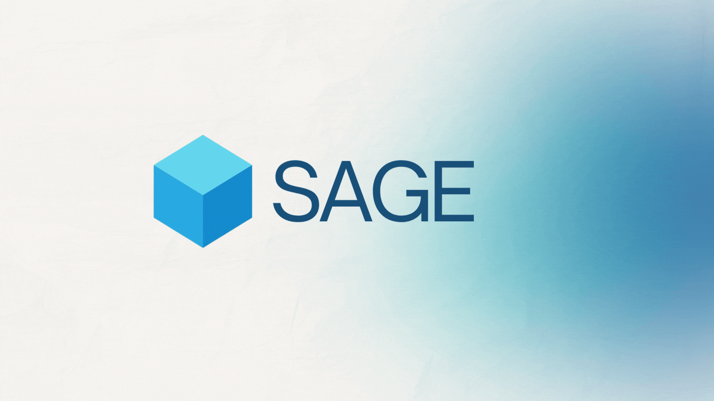

<p align="center">
  
</p>

<div align="center">

# Sage - AI-Powered Intelligent Recruitment Platform

An end-to-end intelligent recruitment platform that automates the hiring lifecycle through AI-powered CV parsing, semantic candidate-job matching, adaptive assessment generation, and multi-dimensional interview analysis.

[](https://www.python.org/)
[](https://www.djangoproject.com/)
[](https://www.django-rest-framework.org/)
[](https://react.dev/)
[](https://www.typescriptlang.org/)
[](https://vitejs.dev/)
[](https://tailwindcss.com/)
[](https://www.mysql.com/)
[](https://www.langchain.com/)
[](https://ollama.com/)
[](https://www.trychroma.com/)

</div>

---

## What is SAGE?

SAGE is a full-stack, AI-driven recruitment platform built as a Final Year Project. It automates the entire hiring pipeline on both sides of the table - candidates upload their CV, get matched to relevant roles, sit a generated assessment, then complete a voice-based AI interview. Recruiters manage everything through a separate analytics dashboard.

Three independently running applications share a single Django REST backend:

| Application | Audience | Stack |
|---|---|---|
| Candidate Portal | Job seekers | React + TypeScript + Vite |
| HR Dashboard | Recruiters | React + Shadcn/UI + Recharts |
| Backend API | Shared service layer | Django REST Framework + MySQL |

---

## Key Features

### Candidate Portal

- **CV Onboarding** - Upload a PDF resume; spaCy extracts skills, experience, education, and projects into a structured profile automatically
- **Semantic Job Matching** - `sentence-transformers` embeddings rank jobs by cosine similarity against the candidate's profile
- **AI-Generated Tests** - RAG pipeline (LangChain + Ollama + ChromaDB) generates role-specific MCQ assessments from job descriptions
- **Voice Interview** - gTTS reads questions aloud; OpenAI Whisper transcribes responses; scoring runs immediately after each answer
- **Application Tracking** - Full timeline of status changes from applied through offer or rejection
- **Saved Jobs** - Bookmark listings; manage resume, skills, education, and work history

### HR Dashboard

- **Pipeline Overview** - KPI cards and charts across the full recruitment funnel (Recharts)
- **Applicant Table** - Filterable list of all candidates with inline status management
- **Kanban Board** - Visual drag-style pipeline from screening to offer
- **Interview Review** - Per-applicant interview scores, confidence ratings, and transcripts
- **Job Postings** - Create, edit, and deactivate listings; configure test parameters per role
- **Department Management** - Organise roles and headcount by department
- **Pipeline Insights** - Stage-by-stage drop-off analysis and conversion rates

### AI Engine

The interview scoring engine evaluates each candidate response across five independent dimensions:

| Dimension | Method |
|---|---|
| Communication | Readability and fluency via `textstat` |
| Relevance | Semantic similarity to expected answer via `sentence-transformers` |
| Technical Depth | Keyword and concept density analysis |
| Reasoning | Logical structure and argument coherence |
| Confidence | Facial expression and posture analysis via MediaPipe + DeepFace |

Final interview score is a weighted average of all five dimensions.

---

## Tech Stack

### Backend

| Package | Version | Purpose |
|---|---|---|
| Django | 5.2.4 | Web framework and ORM |
| djangorestframework | 3.16.0 | REST API layer |
| djangorestframework-simplejwt | 5.5.0 | JWT authentication |
| mysqlclient | 2.2.7 | MySQL database driver |
| spacy | 3.8.7 | CV / NLP parsing |
| sentence-transformers | 3.4.1 | Semantic embeddings |
| langchain-ollama | 0.3.3 | LLM inference via Ollama |
| langchain-chroma | 0.2.4 | Vector store integration |
| chromadb | >=1.0.9 | Embedding vector store |
| gTTS | 2.5.3 | Interview question text-to-speech |
| openai-whisper | latest | Interview response transcription |
| mediapipe | latest | Pose and facial landmark detection |
| deepface | latest | Facial emotion recognition |
| opencv-python | latest | Video frame processing |
| textstat | latest | Readability scoring |

### Candidate Portal

| Package | Version | Purpose |
|---|---|---|
| react | 19.1.1 | UI framework |
| typescript | 5.9.3 | Type-safe JavaScript |
| vite | 7.1.7 | Build tooling |
| react-router-dom | 7.10.1 | Client-side routing |
| framer-motion | 12.25.0 | Animations |
| axios | 1.12.2 | HTTP client |
| react-leaflet | 5.0.0 | Interactive maps |
| tailwindcss | 4.x | Utility CSS |

### HR Dashboard

| Package | Version | Purpose |
|---|---|---|
| react | 19.2.0 | UI framework |
| vite | 7.2.4 | Build tooling |
| @radix-ui/* | latest | Accessible UI primitives |
| recharts | 3.5.1 | Data visualisation |
| framer-motion | 12.23.24 | Animations |
| lucide-react | 0.555.0 | Icon set |
| tailwindcss | 3.4.18 | Utility CSS |

---

## Project Structure

```
Final-Year-Project/
|
+-- backend/
|   +-- myapi/
|   |   +-- models.py          # Core data models
|   |   +-- serializers.py     # DRF serializers
|   |   +-- views.py           # API endpoints
|   |   +-- urls.py            # URL routing
|   +-- interview/
|   |   +-- communication.py   # Fluency scoring
|   |   +-- confidence.py      # Visual confidence scoring
|   |   +-- relevance.py       # Semantic relevance scoring
|   |   +-- technical.py       # Technical depth scoring
|   |   +-- reasoning.py       # Reasoning quality scoring
|   +-- CV-Parser/             # spaCy resume extraction
|   +-- test_generator/        # RAG MCQ generation pipeline
|   |   +-- RAG_FYP/           # LangChain + ChromaDB + Ollama
|   +-- Sage_Questions/        # Question bank
|   +-- run_test_suite.py      # Automated test runner
|   +-- requirements.txt
|
+-- frontend/
|   +-- src/
|       +-- components/
|       |   +-- Auth/                  # Login and registration
|       |   +-- MainLayout/            # Home, Jobs, Applications, Profile
|       |   +-- TestPageLayout/        # Assessment interface
|       |   +-- InterviewPageLayout/   # Voice interview interface
|       |   +-- Onboarding/            # CV-driven profile setup
|       +-- contexts/                  # Auth and SavedJobs providers
|       +-- utils/
|
+-- hr_dashboard/
|   +-- src/
|       +-- components/dashboard/      # Reusable widgets
|       +-- pages/
|           +-- Dashboard.jsx          # KPI overview
|           +-- Applicants.jsx         # Candidate management
|           +-- Interviews.jsx         # Interview tracking
|           +-- JobPostings.jsx        # Job listing management
|           +-- Kanban.jsx             # Visual pipeline
|           +-- Departments.jsx        # Department management
|           +-- Analytics.jsx          # Charts and metrics
|           +-- PipelineInsights.jsx   # Funnel analysis

```

---

## Getting Started

### Prerequisites

| Tool | Required Version |
|---|---|
| Python | 3.11 or later |
| Node.js | 20.x or later |
| MySQL | 8.0 or later |
| Ollama | Latest stable |

Ollama must be running with a supported model pulled before the backend will serve test generation requests.

---

### Backend

```bash
cd backend

# Create and activate a virtual environment
python -m venv venv
venv\Scripts\activate        # Windows
source venv/bin/activate     # macOS / Linux

# Install dependencies
pip install -r requirements.txt

# Download the spaCy language model
python -m spacy download en_core_web_sm

# Set environment variables
copy .env.example .env       # then edit the file

# Import the database
mysql -u root -p < ../sage_db.sql

# Run migrations
python manage.py migrate

# Start the server
python manage.py runserver
```

API base URL: `http://localhost:8000`

---

### Candidate Portal

```bash
cd frontend
npm install
npm run dev
```

Available at: `http://localhost:5173`

---

### HR Dashboard

```bash
cd hr_dashboard
npm install
npm run dev
```

Available at: `http://localhost:5174`

---

## API Reference

All routes are prefixed `/api/`. Requests to protected routes require an `Authorization: Bearer <token>` header.

| Method | Endpoint | Description |
|---|---|---|
| POST | `/api/auth/register/` | Create a new account |
| POST | `/api/auth/login/` | Authenticate and receive JWT |
| GET / PUT | `/api/profile/` | Read or update user profile |
| POST | `/api/cv/parse/` | Parse an uploaded PDF resume |
| GET | `/api/jobs/` | List active job postings |
| GET | `/api/jobs/recommended/` | Semantically ranked job matches |
| POST | `/api/applications/` | Submit an application |
| GET | `/api/applications/` | List the current user's applications |
| GET | `/api/test/{job_id}/` | Retrieve a generated assessment |
| POST | `/api/test/submit/` | Submit assessment answers |
| POST | `/api/interview/start/` | Begin an AI interview session |
| POST | `/api/interview/score/` | Score a single interview response |
| GET | `/api/hr/applicants/` | List all applicants (HR only) |
| GET | `/api/hr/analytics/` | Aggregated recruitment metrics |
| PUT | `/api/hr/applications/{id}/status/` | Update an applicant's pipeline status |

---

## AI Modules

### CV Parser - `backend/CV-Parser/`

Uses spaCy to extract structured data from PDF resumes: personal information, classified skills (language, framework, tool, soft skill), education with GPA, work experience with responsibilities, projects, certifications, and publications.

### Test Generator - `backend/test_generator/`

A retrieval-augmented generation pipeline. Job descriptions are embedded and stored in ChromaDB. At test time, LangChain retrieves the most relevant context and passes it to a locally running Ollama model, which generates role-specific multiple-choice questions.

### Interview Bot - `backend/interview/`

Five scoring modules run independently per response and are combined into a final weighted score:

- `communication.py` - readability, sentence fluency, and coherence (textstat)
- `relevance.py` - cosine similarity between the answer and expected key points (sentence-transformers)
- `technical.py` - technical term density and concept coverage
- `reasoning.py` - logical connective density and argument structure
- `confidence.py` - MediaPipe pose estimation and DeepFace emotion classification from the interview recording

### Job Matcher

On profile completion or update, sentence-transformer embeddings are computed for both the candidate profile and all active job descriptions. Cosine similarity scores rank the jobs returned by the `/api/jobs/recommended/` endpoint.

---

## Contributing

1. Fork the repository
2. Create a feature branch (`git checkout -b feature/your-feature`)
3. Commit your changes (`git commit -m "Add your feature"`)
4. Push to the branch (`git push origin feature/your-feature`)
5. Open a pull request

Please open an issue first to discuss significant changes before submitting a PR.


</div>

