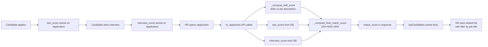

# 🏆 Top Candidates by Match — Implementation Walkthrough

---

## What Was Built

The `/applicants` page in the HR Dashboard now shows the **Top Candidates by Match Score**, ranked by a real weighted composite score computed from three data sources. HR can also filter by job title to compare candidates within a specific role.

---

## Scoring Formula

```
Final Match Score = (Skill Score × 10%) + (Assessment Score × 50%) + (Interview Score × 40%)
```

| Component | Weight | Source |
|---|---|---|
| **Skill-to-JD Score** | 10% | Computed: candidate skills vs job description overlap |
| **Assessment Score** | 50% | Stored in `applications.test_score` (0–100) |
| **Interview Score** | 40% | Stored in `applications.interview_score` (0–100) |

> [!IMPORTANT]
> If a score is missing (e.g. interview not done yet), its weight is **redistributed proportionally** among the available scores. This means partial candidates still get a meaningful score instead of being hidden.

**Example — candidate with only Test score done:**
```
weights available: test(0.50)
Final = test_score / 0.50 → normalized correctly
```

---

## Files Changed

### 1. `backend/myapi/views.py`

#### New Helper: `_compute_skill_score()`

```python
def _compute_skill_score(skills_list, job):
    """
    Compute 0-100 skill-to-JD overlap score.
    Checks how many of the candidate's skills appear
    in the job title + description + requirements.
    """
```

- Takes the candidate's skills list and the related `Job` object
- Builds a single lowercase text blob from job `title + description + requirements + responsibilities`
- Counts how many skills appear in that text
- Returns `round((matched / total_skills) * 100)`
- Returns `None` if no skills or no job linked

#### New Helper: `_compute_final_match_score()`

```python
def _compute_final_match_score(skill_score, test_score, interview_score):
    """
    Weighted composite — weights renormalized when a component is None.
    skill=10%, test=50%, interview=40%
    """
```

- Collects only non-None components
- Normalizes total weight to 1.0 before computing
- Returns `None` only if ALL three components are missing

#### Updated: `_serialize_hr_applicant()`

```diff
- 'match_score': None,   # was always hardcoded None

+ job_obj = getattr(app, 'job', None)
+ skill_score = _compute_skill_score(skills_list, job_obj)
+ test_score = app.test_score
+ interview_score = app.interview_score
+ final_match_score = _compute_final_match_score(skill_score, test_score, interview_score)

+ 'skill_score': skill_score,        # new field
+ 'match_score': final_match_score,  # now real, not None
```

Also added `select_related('job')` to the queryset so `app.job` is fetched efficiently in one SQL join.

#### Updated: `hr_applicants()` view

```diff
+ job_title_filter = request.GET.get('job_title', '').strip()
+ if job_title_filter:
+     qs = qs.filter(job_title__iexact=job_title_filter)

+ job_titles = Application.objects.exclude(...).values_list('job_title', flat=True).distinct()

  return Response({
      'success': True,
      'applicants': applicants,
+     'job_titles': list(job_titles),   # new — powers the dropdown
  })
```

---

### 2. `hr_dashboard/src/lib/apiClient.js`

#### Updated: `toCamelApplicant` mapper

```diff
+ skillScore: row.skill_score,   // 10% — skill vs JD overlap (0-100)
  matchScore: row.match_score,   // now a real weighted score
```

#### Updated: `fetchApplicants()`

```diff
- export async function fetchApplicants({ startDate, endDate } = {}) {
+ export async function fetchApplicants({ startDate, endDate, jobTitle } = {}) {
+   if (jobTitle) params.append("job_title", jobTitle);

-   return (data.applicants || []).map(toCamelApplicant);
+   return {
+     applicants: (data.applicants || []).map(toCamelApplicant),
+     jobTitles: data.job_titles || [],
+   };
```

---

### 3. `hr_dashboard/src/pages/Applicants.jsx`

#### New state

```js
const [jobTitles, setJobTitles] = useState([]);
const [jobTitleFilter, setJobTitleFilter] = useState("all");
```

#### Updated data fetch

```js
fetchApplicants()
  .then(({ applicants: rows, jobTitles: titles }) => {
    setApplicants(rows || []);
    setJobTitles(titles || []);   // populates dropdown
  })
```

#### Updated `topCandidates` memo

```js
const topCandidates = useMemo(() => {
  const base =
    jobTitleFilter === "all"
      ? applicants
      : applicants.filter((a) => a.role === jobTitleFilter);   // job filter
  return [...base]
    .filter((a) => Number.isFinite(a.matchScore))              // only scored
    .sort((a, b) => (b.matchScore || 0) - (a.matchScore || 0)) // highest first
    .slice(0, 5);                                               // top 5
}, [applicants, jobTitleFilter]);
```

#### New Top Candidates card UI

````carousel
**Card Header**
- Title: "Top Candidates by Match"
- Subtitle: "Skill 10% · Assessment 50% · Interview 40%"
- Right side: **Job Title Filter dropdown** (All Jobs + each distinct job title)

<!-- slide -->
**Each candidate row shows:**
```
#1  [Name]                    [Status Badge]   [88%]
    [Job Title]
    ████████████████████░░░░  ← color-coded progress bar
    [Skill 70%]  [Test 90%]  [Interview 85%]  [Education]
```
Color coding:
- 🟢 ≥80% → emerald
- 🔵 ≥60% → indigo  
- 🟡 ≥40% → amber
- 🔴 <40%  → red

<!-- slide -->
**Score breakdown chips (per candidate)**

| Chip | Color | Weight |
|---|---|---|
| Skill X% | violet | 10% |
| Test X% | blue | 50% |
| Interview X% | amber | 40% |
| Education | gray | display only |

<!-- slide -->
**Detail Modal — Score Tiles (updated)**

| Tile | Label | Color |
|---|---|---|
| Skill (10%) | violet | `skillScore` |
| Test (50%) | blue | `testScore` |
| Interview (40%) | amber | `interviewScore` |
| **Final Match** | emerald | `matchScore` (weighted composite) |
````

---

## Data Flow (End-to-End)



---

## Edge Cases Handled

| Scenario | Behavior |
|---|---|
| Candidate has no test score | Weights redistributed: skill(10%→20%) + interview(40%→80%) |
| Candidate has no interview yet | Weights redistributed: skill(10%→17%) + test(50%→83%) |
| Candidate has no skills in profile | `skill_score = None`, excluded from weighting |
| Application not linked to a Job | `skill_score = None` (no JD to compare against) |
| All 3 scores missing | `match_score = None`, candidate excluded from Top Candidates |
| Job title filter: "No results" | Shows message `No scored candidates found for "..."` |
